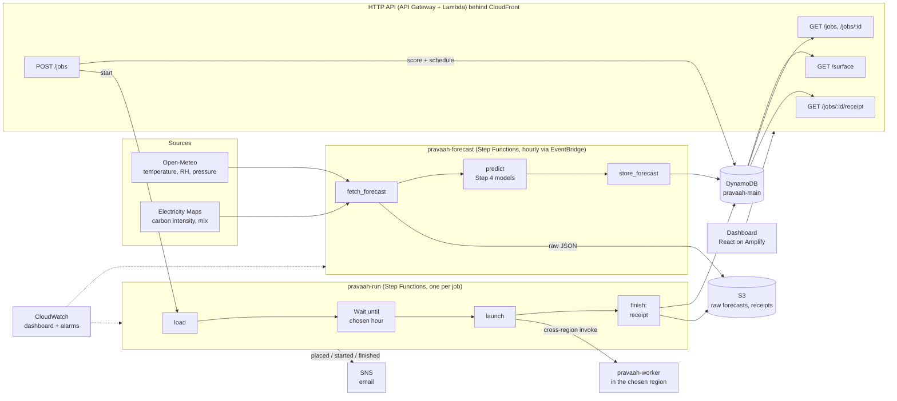

# Architecture

**The cost model** (`model/`) and **the scheduler** (`scheduler/`) are plain Python
libraries. The same code runs in the CLI, the tests, the trace replay and the Lambdas
(packaged in one layer).

**Every number has a source** (`model/coefficients.yaml`). **Every forecast row carries
where it came from** (`weather_source`, `ci_source`, `t_wb_source`). The dashboard shows
when anything is synthetic or modelled.

## Facility power integration

The simulator publishes to AWS IoT Core; its rule invokes the power-event Lambda.
A shared deterministic gate commits facility state, existing JOB records, event IDs
and decisions atomically to the existing table. EventBridge reevaluates deadline
boundaries every minute. Waiting cloud jobs remain in the same run state machine
and use its conditional launch guard; running proxies are never paused.
React Power & Operations reads persisted state and authenticated controls publish
through IoT. Facilities are physical sites, never whole AWS regions.
See [DG-Shift operation and limitations](dg-shift.md).
