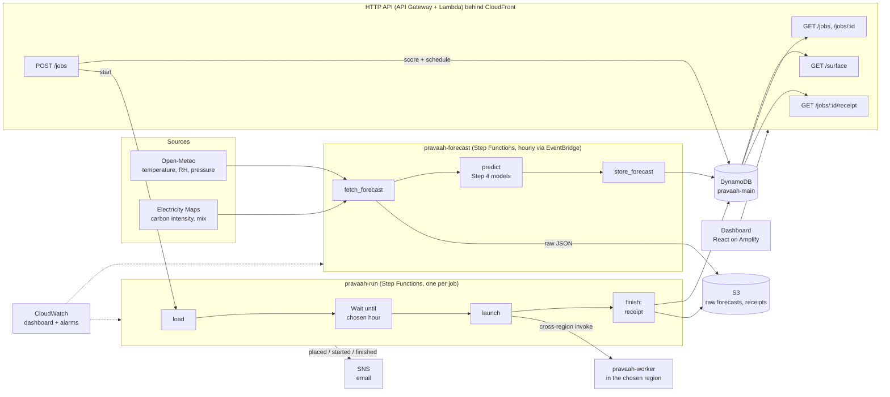

# Architecture

**The cost model** (`model/`) and **the scheduler** (`scheduler/`) are plain Python
libraries. The same code runs in the CLI, the tests, the trace replay and the Lambdas
(packaged in one layer).

**Every number has a source** (`model/coefficients.yaml`). **Every forecast row carries
where it came from** (`weather_source`, `ci_source`, `t_wb_source`). The dashboard shows
when anything is synthetic or modelled.
